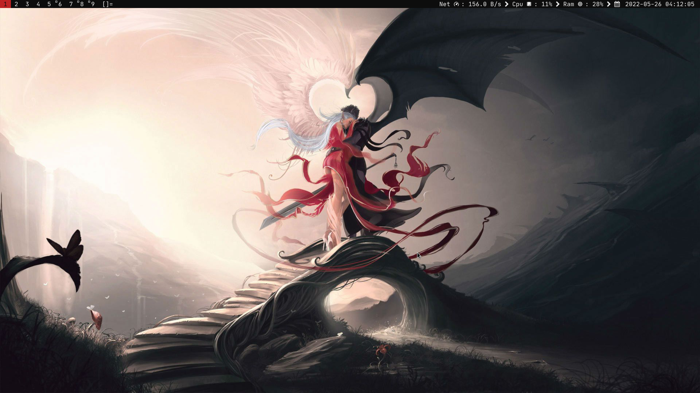

# DWM
## Description
This Repository is a fork of [DWM - Dynamic Window Manager](https://dwm.suckless.org/), by Suckless Software.

## Screenshots

## Changes
### Patches
- [Useless Gap](https://dwm.suckless.org/patches/uselessgap/dwm-uselessgap-20211119-58414bee958f2.diff)
- [Systray](https://dwm.suckless.org/patches/systray/dwm-systray-6.3.diff)

### Changes
- Removed Old ColorScheme
- Added Red On Black Theme
- Changed Font
- Modified Floating Window Settings
- Modified Dmenu Command
- Added Custom Dmenu Script Support
- Added a few patches

## Installing
- Clone this Repository 
	- `git clone https://github.com/ddenobrega/dwm`
- Change your working directory into this Repositories' 
	- `cd dwm`
- Compile and install dwm
	- `sudo make clean install`

### Dependencies
- glibc
- xinerama
- Xft
- xorg-server
- JetBrainsMono Nerd Font

## Credits
- [Useless Gap Authors](https://dwm.suckless.org/uselessgap)
- [Systray Authors](https://dwm.suckless.org.systray)
- [Suckless Community](https://suckless.org)
- [My Portfolio](https://ddenobrega.github.io)
- [My Github](https://github.com/ddenobrega)
- Email: dcdenobrega@gmail.com

